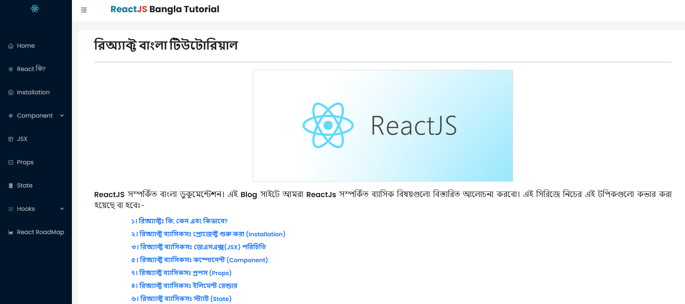
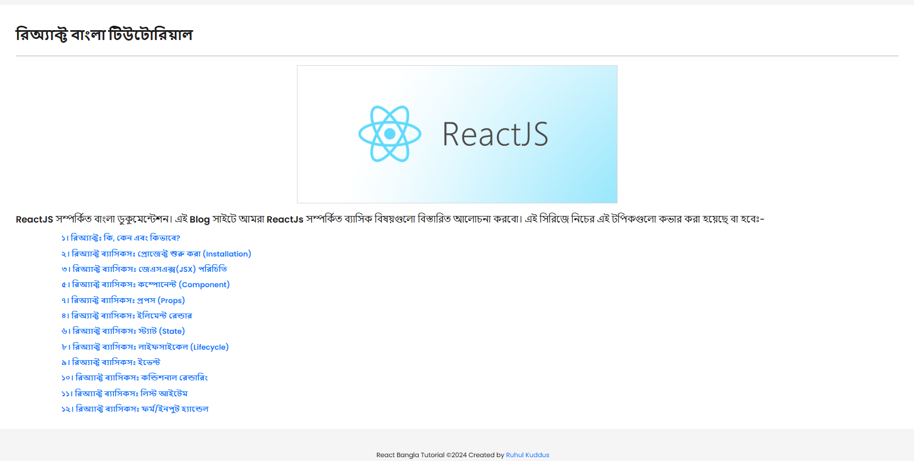

## React Bangla Tutorial

<table>
    <thead>
        <tr>
            <th>
                
            </th>
        </tr>
    </thead>
</table>

### Bangla React Documentation
<blockquote>
 A beginner-friendly, open-source documentation website for learning React in Bangla. Built with React, JavaScript, and Bootstrap, this project aims to make React more accessible to Bangla-speaking developers.
</blockquote>

## Features 
<ol>
  <li>React? রিঅ্যাক্টঃ কি, কেন এবং কিভাবে?</li>
  <li>রিঅ্যাক্ট ব্যাসিকসঃ প্রোজেক্ট শুরু করা (Installation)</li>
  <li>রিঅ্যাক্ট ব্যাসিকসঃ জেএসএক্স(JSX) পরিচিতি</li>
  <li>রিঅ্যাক্ট ব্যাসিকসঃ ইলিমেন্ট রেন্ডার</li>
  <li>রিঅ্যাক্ট ব্যাসিকসঃ কম্পোনেন্ট (Component)</li>
  <li>রিঅ্যাক্ট ব্যাসিকসঃ স্ট্যাট (State)</li>
  <li>রিঅ্যাক্ট ব্যাসিকসঃ প্রপস (Props)</li>
  <li>রিঅ্যাক্ট ব্যাসিকসঃ লাইফসাইকেল (Lifecycle)</li>
  <li>রিঅ্যাক্ট ব্যাসিকসঃ ইভেন্ট</li>
  <li>রিঅ্যাক্ট ব্যাসিকসঃ কন্ডিশনাল রেন্ডারিং</li>
  <li>রিঅ্যাক্ট ব্যাসিকসঃ লিস্ট আইটেম</li>
  <li>রিঅ্যাক্ট ব্যাসিকসঃ ফর্ম/ইনপুট হ্যান্ডেল</li>
</ol>

## Technology
<ul>
    <li>React</li>
    <li>Ant Design of React</li>
    <li>JavaScript</li>
    <li>HTML</li>
    <li>CSS</li>
    <li>Bootstrap</li>
</ul>

## Main Content
<table>
    <thead>
        <tr>
            <th>
                
            </th>
        </tr>
    </thead>
</table>
